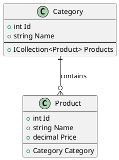

# Hướng Dẫn Vẽ Class Diagram cho Dự Án Toocha

## Tổng Quan Dự Án

**Toocha** là một hệ thống quản lý cửa hàng trà sữa được xây dựng bằng ASP.NET Core MVC với Entity Framework Core. Hệ thống bao gồm các chức năng chính:

- Quản lý sản phẩm và danh mục
- Quản lý đơn hàng và giao hàng
- Hệ thống khuyến mãi và giảm giá
- Quản lý cửa hàng và địa điểm
- Hệ thống đánh giá sản phẩm
- Quản lý người dùng và phân quyền

## Cấu Trúc Class Diagram

### 1. Các Nhóm Class Chính

#### A. Identity & Authentication
- **AppUser**: Người dùng hệ thống (kế thừa từ IdentityUser)
- **IdentityRole**: Vai trò người dùng
- **AppDbContext**: Database context (kế thừa từ IdentityDbContext)

#### B. Core Business Models
- **Category**: Danh mục sản phẩm
- **Product**: Sản phẩm
- **Store**: Cửa hàng/Chi nhánh
- **Order**: Đơn hàng
- **OrderItem**: Chi tiết đơn hàng
- **Topping**: Topping cho sản phẩm
- **Size**: Kích thước sản phẩm

#### C. Supporting Models
- **Discount**: Khuyến mãi/Giảm giá
- **ProductReview**: Đánh giá sản phẩm
- **OrderItemTopping**: Liên kết giữa OrderItem và Topping

#### D. Enums
- **OrderStatus**: Trạng thái đơn hàng
- **DiscountType**: Loại khuyến mãi

### 2. Mối Quan Hệ Giữa Các Class

#### Quan Hệ 1-nhiều (One-to-Many)
```
AppUser ||--o{ Order : places
Category ||--o{ Product : contains
Store ||--o{ Order : fulfills
Order ||--o{ OrderItem : contains
Product ||--o{ OrderItem : ordered_in
Product ||--o{ ProductReview : reviewed_in
```

#### Quan Hệ Nhiều-nhiều (Many-to-Many)
```
OrderItem ||--o{ OrderItemTopping : includes
Topping ||--o{ OrderItemTopping : used_in
```

#### Quan Hệ 1-nhiều với Nullable
```
Product ||--o{ Discount : has
Category ||--o{ Discount : applies_to
```

### 3. Cách Vẽ Class Diagram

#### Bước 1: Xác định các Class chính
1. **AppUser**: Class người dùng
2. **Product**: Class sản phẩm
3. **Order**: Class đơn hàng
4. **Category**: Class danh mục
5. **Store**: Class cửa hàng

#### Bước 2: Vẽ các thuộc tính (Properties)
- Sử dụng `+` cho public properties
- Sử dụng `-` cho private properties
- Sử dụng `#` cho protected properties
- Ghi rõ kiểu dữ liệu: `string`, `int`, `decimal`, `DateTime`, etc.

#### Bước 3: Vẽ các phương thức (Methods)
- Tách biệt properties và methods bằng dấu `--`
- Ghi rõ kiểu trả về và tham số

#### Bước 4: Vẽ mối quan hệ
- **Composition** (`||--||`): Quan hệ mạnh, một đối tượng sở hữu đối tượng khác
- **Aggregation** (`o--o`): Quan hệ yếu, một đối tượng chứa đối tượng khác
- **Association** (`--`): Quan hệ đơn giản
- **Inheritance** (`--|>`): Kế thừa

### 4. Công Cụ Vẽ Class Diagram

#### A. PlantUML (Khuyến nghị)


#### B. Draw.io (diagrams.net)
- Miễn phí, dễ sử dụng
- Có nhiều template UML
- Export được nhiều định dạng

#### C. Visual Studio
- Tích hợp sẵn với .NET
- Tự động generate từ code
- Có thể reverse engineering

#### D. Lucidchart
- Chuyên nghiệp
- Có nhiều template
- Hỗ trợ collaboration

### 5. Best Practices

#### A. Đặt tên Class
- Sử dụng PascalCase: `Product`, `OrderItem`
- Tên phải mô tả rõ chức năng
- Tránh viết tắt không rõ nghĩa

#### B. Sắp xếp Class
- Nhóm các class liên quan lại với nhau
- Đặt class chính ở giữa
- Class phụ thuộc ở xung quanh

#### C. Mối quan hệ
- Sử dụng mũi tên có hướng rõ ràng
- Ghi chú mô tả mối quan hệ
- Tránh vẽ quá nhiều đường kết nối

#### D. Thuộc tính
- Chỉ hiển thị thuộc tính quan trọng
- Sử dụng `ICollection<T>` cho collection
- Ghi rõ nullable với `?`

### 6. Ví Dụ Cụ Thể

#### Class Product
```
+------------------------+
|       Product          |
+------------------------+
| +int Id                |
| +string Name           |
| +string Description    |
| +decimal Price         |
| +decimal? SalePrice    |
| +string Image          |
| +int CategoryId        |
| +int StockQuantity     |
| +bool IsPublished      |
+------------------------+
| +Category Category     |
| +ICollection<Review>   |
+------------------------+
```

#### Mối quan hệ Product-Category
```
Category ||--o{ Product : contains
```

### 7. Các Lưu Ý Quan Trọng

1. **Navigation Properties**: Sử dụng virtual để lazy loading
2. **Foreign Keys**: Luôn có FK để đảm bảo referential integrity
3. **Validation**: Sử dụng Data Annotations
4. **Computed Properties**: Đánh dấu `[NotMapped]`
5. **Enums**: Sử dụng cho các giá trị cố định

### 8. Tài Liệu Tham Khảo

- [PlantUML Documentation](https://plantuml.com/class-diagram)
- [Entity Framework Core Documentation](https://docs.microsoft.com/en-us/ef/core/)
- [UML Class Diagram Tutorial](https://www.visual-paradigm.com/guide/uml-unified-modeling-language/uml-class-diagram-tutorial/)

### 9. Kết Luận

Class diagram là công cụ quan trọng để:
- Hiểu rõ cấu trúc hệ thống
- Giao tiếp với team
- Lập kế hoạch phát triển
- Tài liệu hóa hệ thống

Với dự án Toocha, class diagram giúp hiểu rõ mối quan hệ giữa các entity và cách chúng tương tác với nhau trong hệ thống quản lý cửa hàng trà sữa. 