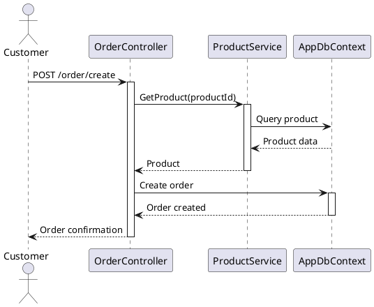
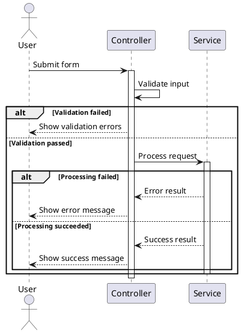

# Hướng Dẫn Vẽ Sequence Diagram cho Dự Án Toocha

## Tổng Quan

**Sequence Diagram** là một loại UML diagram mô tả tương tác giữa các đối tượng trong hệ thống theo thời gian. Đối với dự án Toocha, sequence diagram giúp hiểu rõ luồng xử lý của các chức năng chính.

## Các File Sequence Diagram Đã Tạo

### 1. `toocha_sequence_diagrams.puml`
- **Mô tả**: Tập hợp 8 sequence diagram chính
- **Bao gồm**: Đăng ký, đăng nhập, đặt hàng, quản lý sản phẩm, xử lý đơn hàng, tìm kiếm, khuyến mãi, đánh giá
- **Sử dụng khi**: Cần xem tổng quan tất cả các luồng

### 2. `toocha_order_sequence.puml`
- **Mô tả**: Sequence diagram chi tiết cho quy trình đặt hàng
- **Bao gồm**: 7 bước từ chọn sản phẩm đến cập nhật trạng thái
- **Sử dụng khi**: Cần hiểu chi tiết luồng đặt hàng

### 3. `toocha_auth_sequence.puml`
- **Mô tả**: Sequence diagram cho xác thực và phân quyền
- **Bao gồm**: Đăng ký, xác thực email, đăng nhập, phân quyền, đăng xuất, quên mật khẩu
- **Sử dụng khi**: Cần hiểu luồng authentication

### 4. `toocha_admin_sequence.puml`
- **Mô tả**: Sequence diagram cho các chức năng quản trị
- **Bao gồm**: Quản lý sản phẩm, đơn hàng, người dùng, báo cáo, khuyến mãi, cửa hàng
- **Sử dụng khi**: Cần hiểu luồng admin

## Cách Vẽ Sequence Diagram

### 1. Các Thành Phần Cơ Bản

#### A. Actor (Người dùng)
```plantuml
actor Customer as C
actor Admin as A
actor Staff as S
```

#### B. Participant (Thành phần hệ thống)
```plantuml
participant "OrderController" as OC
participant "ProductService" as PS
participant "AppDbContext" as DB
```

#### C. Lifeline (Đường đời)
- Hiển thị thời gian tồn tại của đối tượng
- Sử dụng `activate` và `deactivate`

#### D. Message (Tin nhắn)
```plantuml
C -> OC: POST /order/create          # Synchronous message
OC --> C: Order confirmation         # Return message
OC -> NS: SendNotification()         # Method call
```

### 2. Cú Pháp PlantUML

#### A. Styling
```plantuml
skinparam sequence {
    ArrowColor DarkBlue
    ActorBorderColor DarkBlue
    LifeLineBorderColor DarkBlue
    LifeLineBackgroundColor LightBlue
    ParticipantBorderColor DarkBlue
    ParticipantBackgroundColor LightBlue
}
```

#### B. Activation/Deactivation
```plantuml
activate OC
OC -> PS: GetProduct()
deactivate OC
```

#### C. Alternative (if/else)
```plantuml
alt Product exists
    OC -> DB: Save order
    OC --> C: Success
else Product not found
    OC --> C: Error
end
```

#### D. Notes
```plantuml
note right of PS
- Validate product data
- Check stock availability
- Calculate price
end note
```

#### E. Grouping
```plantuml
== Bước 1: Chọn Sản Phẩm ==
C -> OC: GET /products
```

### 3. Các Pattern Thường Dùng

#### A. CRUD Operations
```plantuml
actor User as U
participant "Controller" as C
participant "Service" as S
participant "Database" as DB

U -> C: Create/Read/Update/Delete
activate C
C -> S: Process request
activate S
S -> DB: Execute query
activate DB
DB --> S: Result
deactivate DB
S --> C: Processed data
deactivate S
C --> U: Response
deactivate C
```

#### B. Validation Pattern
```plantuml
C -> C: Validate input
alt Valid
    C -> S: Process request
    S --> C: Success
else Invalid
    C --> U: Error message
end
```

#### C. Notification Pattern
```plantuml
C -> S: Process request
S -> DB: Save data
DB --> S: Saved
S -> NS: Send notification
NS --> S: Sent
S --> C: Success
```

### 4. Best Practices

#### A. Đặt Tên
- **Actor**: Sử dụng vai trò rõ ràng (Customer, Admin, Staff)
- **Participant**: Sử dụng tên class/component thực tế
- **Message**: Mô tả hành động cụ thể

#### B. Tổ Chức
- Nhóm các bước liên quan bằng `== Group ==`
- Sử dụng `alt` cho các trường hợp khác nhau
- Thêm notes để giải thích logic phức tạp

#### C. Chi Tiết
- Không quá chi tiết (không cần hiển thị tất cả method calls)
- Tập trung vào luồng chính
- Hiển thị các điểm quyết định quan trọng

### 5. Ví Dụ Cụ Thể

#### A. Đặt Hàng Đơn Giản


#### B. Xử Lý Lỗi


### 6. Công Cụ Vẽ Sequence Diagram

#### A. PlantUML (Khuyến nghị)
- **Ưu điểm**: Text-based, version control friendly, tự động layout
- **Nhược điểm**: Cần học syntax
- **Sử dụng**: Online editor hoặc IDE plugin

#### B. Draw.io (diagrams.net)
- **Ưu điểm**: Drag & drop, dễ sử dụng
- **Nhược điểm**: Manual layout, khó version control
- **Sử dụng**: Online hoặc desktop app

#### C. Visual Studio
- **Ưu điểm**: Tích hợp với .NET, có thể generate từ code
- **Nhược điểm**: Chỉ dành cho .NET
- **Sử dụng**: Enterprise edition

#### D. Lucidchart
- **Ưu điểm**: Chuyên nghiệp, collaboration
- **Nhược điểm**: Trả phí, online only
- **Sử dụng**: Team collaboration

### 7. Các Lưu Ý Quan Trọng

#### A. Thời Gian
- Sequence diagram mô tả thứ tự thời gian
- Sử dụng `activate` để hiển thị thời gian xử lý
- Các message phải có thứ tự logic

#### B. Tương Tác
- Hiển thị rõ ràng tương tác giữa các component
- Sử dụng return message (`-->`) khi cần thiết
- Phân biệt synchronous và asynchronous

#### C. Exception Handling
- Sử dụng `alt` để xử lý các trường hợp lỗi
- Hiển thị rollback khi cần thiết
- Mô tả cách hệ thống phản hồi lỗi

### 8. Áp Dụng Cho Toocha

#### A. Luồng Chính
1. **Authentication**: Đăng ký, đăng nhập, phân quyền
2. **Ordering**: Chọn sản phẩm, giỏ hàng, đặt hàng
3. **Admin**: Quản lý sản phẩm, đơn hàng, báo cáo

#### B. Điểm Quan Trọng
- **Validation**: Luôn validate input trước khi xử lý
- **Notification**: Gửi thông báo khi có thay đổi trạng thái
- **Error Handling**: Xử lý các trường hợp lỗi gracefully
- **Security**: Kiểm tra quyền truy cập

### 9. Tài Liệu Tham Khảo

- [PlantUML Sequence Diagram](https://plantuml.com/sequence-diagram)
- [UML Sequence Diagram Tutorial](https://www.visual-paradigm.com/guide/uml-unified-modeling-language/uml-sequence-diagram-tutorial/)
- [ASP.NET Core Identity](https://docs.microsoft.com/en-us/aspnet/core/security/authentication/identity)

### 10. Kết Luận

Sequence diagram là công cụ mạnh mẽ để:
- Hiểu luồng xử lý của hệ thống
- Giao tiếp với team về logic nghiệp vụ
- Debug và tối ưu hóa performance
- Tài liệu hóa hệ thống

Với dự án Toocha, sequence diagram giúp hiểu rõ cách các component tương tác với nhau trong các use case chính như đặt hàng, xác thực, và quản trị. 